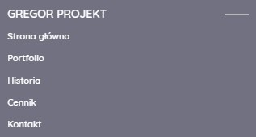
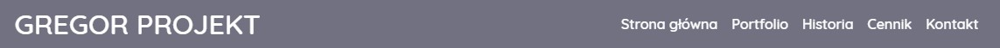
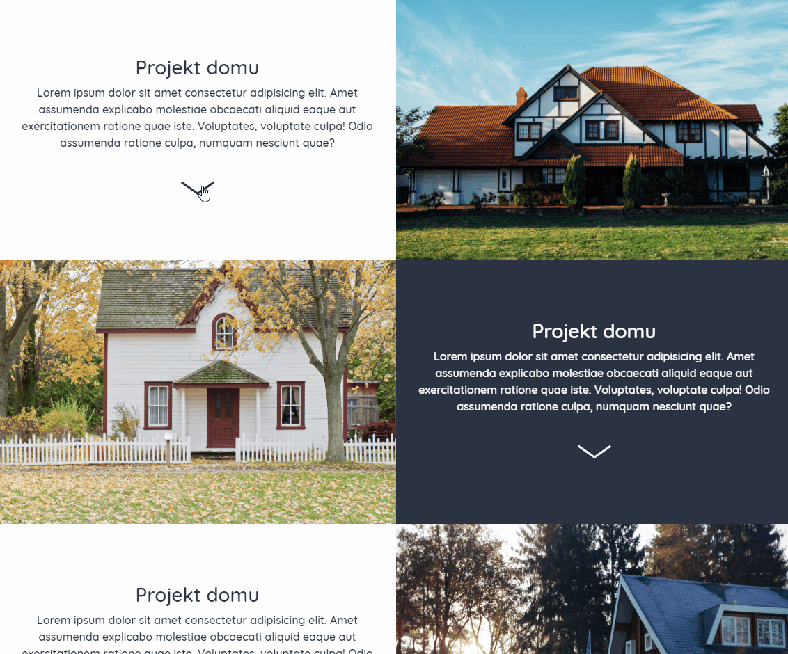
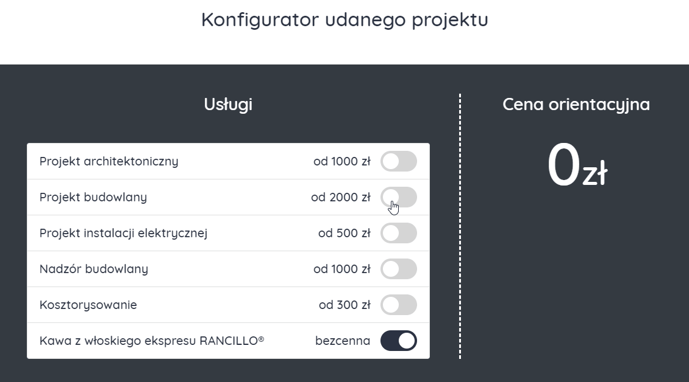
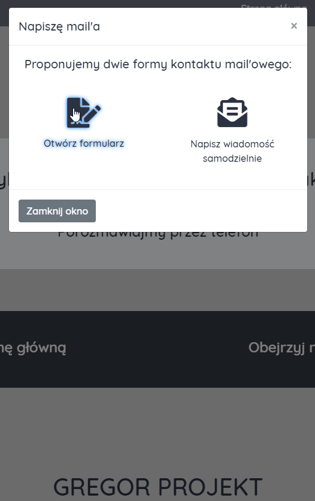
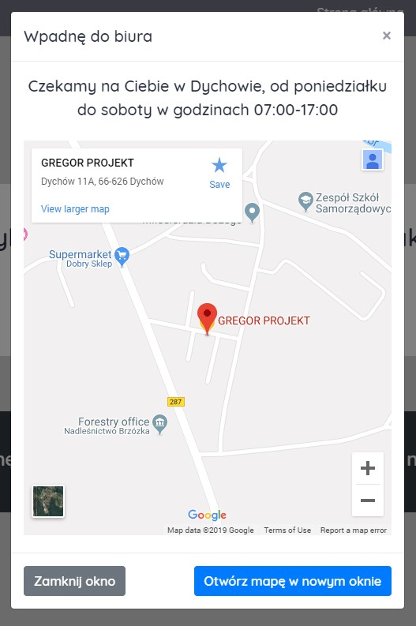

# GREGOR PROJEKT

This project has been developed as an example on how the website [gregorprojekt.com](http://gregorprojekt.com/) could be improved, as well as to improve my front-end programming skills within HTML, CSS, JS and the _React_ framework. There was no design for this project - the website's GUI is an effect of my heroic efforts to make it look at least not unsightly ;)

There was only taken a slight inspiration from the current website look.

## Getting started

These instructions will get you a copy of the project up and running on your local machine for the development and testing purposes.

### Prerequisites

Things you need to install the software:

- Node JS
- npm

### Running the project

This project is based on the _create-react-app_ boilerplate by _Facebook_ and has the built-in dev server. To get it running, type the following commands:

```
yarn
yarn start
```

If you are more interested in getting the compiled production build, please type:

```
yarn
yarn build
```

---

Alternatively, you can use the `npm run` command instead of `yarn`.

### Running the live version

You can also view the [live website](https://gregor-projekt.netlify.com/) hosted on the _Netlify_ servers.

## Main features

### Responsive header/navbar with the expandable/collapsible menu on mobile

|                               Mobile (collapsed menu)                               |                                Mobile (expanded menu)                                |                                  Desktop                                   |
| :---------------------------------------------------------------------------------: | :----------------------------------------------------------------------------------: | :------------------------------------------------------------------------: |
|  |  |  |

### Images slider


### 3D hover effects on the image-based links


### Arrow links animated with the CSS transitions


### Gentle footer reveal


### Case study expand/collapse



### Price estimation calculator



### Expandable/collapsible contact form



### Google Maps embed with directions to the office



## Built with

- [React](https://reactjs.org/) - The _Facebook's_ front-end framework for the modern web.
- [React Router](https://reacttraining.com/react-router/) - The _React Training's_ amazing solution for the client-side routing in the web apps running with _React_.
- [CSS Hamburgers](https://jonsuh.com/hamburgers/) - The simple CSS-generated hamburger buttons.
- [Tilt Hover Effects](https://tympanus.net/codrops/2016/11/23/tilt-hover-effects/) - Amazing ideas for the rich-animated hover efefcts.
- [create-react-app](https://github.com/facebook/create-react-app) - The _Facebook's_ powerful _React_ boilerplate.
- [Bootstrap](https://getbootstrap.com/) - The most popular HTML, CSS, and JS library in the world.

## Authors

- Stanisław Gregor ([staszek998](https://github.com/staszek998)) - _Design & Development_

## License

This project is licensed under the MIT License.
